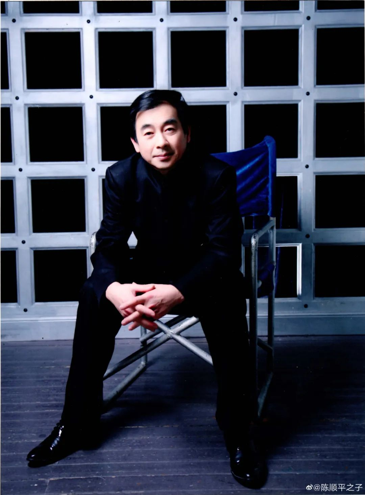
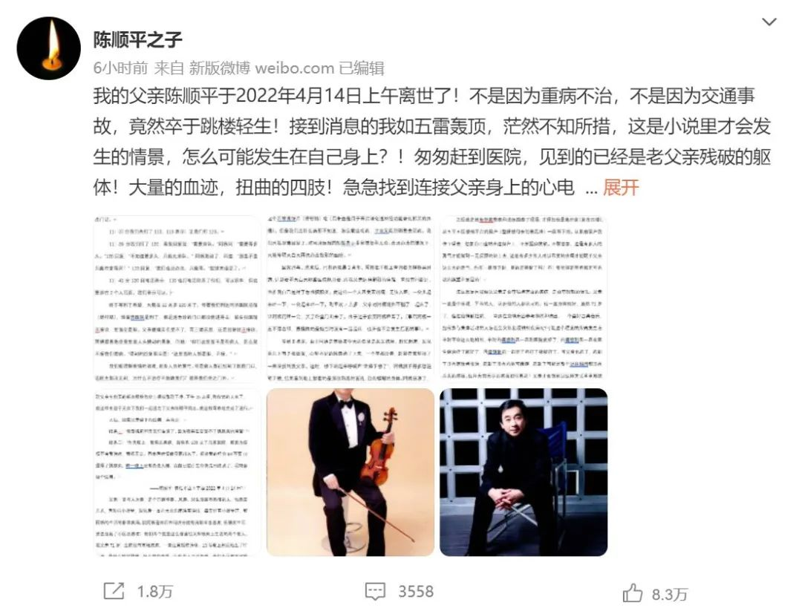
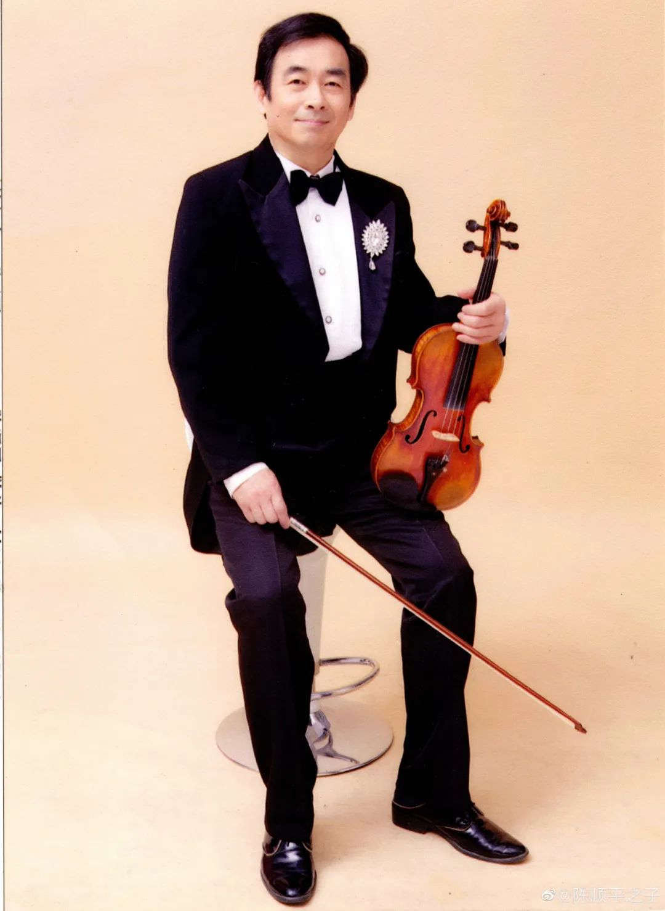

# SH小提琴家被拒诊腹痛难忍跳楼自杀，儿子追问：为何？为何？为何？!

这里信号不好 2022-04-16 16:13

日前有网传消息称，SH小提琴家、古典音乐爱好者陈顺平因为突发疾病剧痛难忍，求诊两家医院均遭拒绝，于4月14日上午跳楼自杀。

4月16日8时42分，其子在微博上发布了父亲发病求诊，到最终不忍剧痛跳楼自杀的全过程。

他称：**写此文不想再指责或追究谁的责任，父亲已经过世，一切都没有意义了。**

**“只是希望通过父亲悲惨的结局，呼吁整个社会，在大力响应抗疫方针的同时，也能更多地关注像我们父亲这样因为无法正常就医而痛苦的人们。以避免更多我父亲这样的悲剧地发生！”**

以下为微博全文：

我的父亲陈顺平于2022年4月14日上午离世了！不是因为重病不治，不是因为交通事故，竟然卒于跳楼轻生！接到消息的我如五雷轰顶，茫然不知所措，这是小说里才会发生的情景，怎么可能发生在自己身上？！匆匆赶到医院，见到的已经是老父亲残破的躯体！大量的血迹，扭曲的四肢！急急找到连接父亲身上的心电图，望着那三条没有起伏的图线，不禁泪奔！从一旁几乎崩溃的阿姨（继母）的口中逐渐了解了事情的整个经过：

2022年4月13日晚上点多，我父系腹部开始感觉不适。起初以为是晚饭吃多了过一会就好了，还用开塞露方便了一下。没想到逐渐开始疼痛，并越来越剧烈，还伴随呕吐 (无腹泻)。

我阿姨发现情况不对，赶紧联系寻求帮助。我们先通过小区党委，再联系小区对接医院事务的同志，第一时间帮我们开到了出门证。

11: 37分我们先打了 110，110表示：让我们打120。

11: 39分我们打了120，客服回复说：“需要排队。”阿姨问：“需要等多久。”120回复： “不知道要多久，只能先排队。”阿姨激动了，问道：“那是不是只能在家等死？” 120回复：“我们也没办法，只能等。”就结束通话了。

11: 41分120回电话表示，110 也打电话联系了他们，可以派车，但还要排在 2 个人后面。 我们表示可以。

终于等到了希望，大概在12点多120 来了。带着我们到达同济医院总院(新村路)，谁曾想医院是到了，但是连急诊的门口都没能进得去，被告知医院不接诊，里面全是阳。

父亲腹痛实在受不了，再三请求后，还是回复说不接诊。阿姨看着急症室里面人头攒动的景象，问她：“你们这里面不是有病人，怎么就不接我们看病。”得到的回复依旧是：“这里面的人都是阳，不接。”

我们能理解疫情的艰难，医务人员的繁忙。可是病人都已经到了医院门口，连医生都没见到，为什么不治疗不救助我们？就将我们拒之门外。

看着同济医院进不去。我们只能坐着120再去找另外的医院，第二家找到的是“第十人民医院”，结果十院没开门。

120 车里医生说今天晚上本来就所有的医院都不接收病人的。如果我们还要再找医院，最近就要送到罗店的医院去。但医院大概率还是不接受病人的，并表示如果是送到罗店的医院，他们120是不负责送我们回来的。这种情况叫不到车回来的情况下，怎么可能还冒风险去罗店碰运气？父亲两人决定还是回家。

回去路上，父亲求120 车上有没有急救的消炎药水，紧急挂个盐水缓解一下也好，但 120 车里也没有盐水可以挂。

120 建议我们：这个病不致命，回家买这个匹维溴锒片 (得舒特) 吃 (后来查是用于医治消化道神经功能紊乱相关的疼痛)。但是我们连什么病都不知道，怎么敢乱吃药，半夜又能到哪里去买药。

我们只能忍痛回家了。对同济医院的拒接非常愤怒和无奈。在没办法的情况下，只能等明天白天再想办法找别的医院。

回家消毒、洗漱后，已将近凌晨3 点多，阿姨在手机上查询着怎样能买到药。计划着明天白天哪些医院能开着。

而我父亲这样剧烈的痛楚一直没有间断过。他推测自己是得了急性胰腺炎。就这样一个人忍受着剧痛，无法入睡，一会儿起床来吐一下，一会起来吐一下。

到早晨7点多，父亲对阿姨说他不躺了，起床了，让阿姨再睡一会，关了卧室门出去了。 由于过于疲劳阿姨睡看了。(事后阿姨一直不停念叨，最懊悔的是她当时没有一起起床，也许也不会发生后面的事)

等到 8 点多，由于阿姨是志愿者，今天的任务是派发抗原，赶忙起床。发现茶几上有 2 张纸条，心里不好的预感涌了上来，一个字都没看，赶紧在家里找了一圈没找到我父亲。

这时，楼下响起来呼喊声“谁摔下楼了”，阿姨顾不得多想赶紧下楼，结果看到地上躺着的是那张熟悉的面孔，血肉模糊的身体。

阿姨崩溃了，抱着父亲呼喊谁能帮帮她！

等到 120 车来了， 送到同济医院抢救室，已经晚了。

阿姨和医院哭诉说：“我们凌晨来急诊的时候你们说不让我们进去，也不和我们说明情况，就说里面都是阳，不接。”

得到解释说：**“昨天晚上是有阳，但是消杀后还是接诊的。”**

阿姨听了更是火了：“为什么来的时候，不详细解释，非要赶人走？我们可以在外面等。那也不会发生悲剧。”

我赶到，只见到父亲这最后一面。

医生告诉我们抢救无效，2022年4月14日9: 58分他走了。

其实我知道， 父亲在跃下落地时就已经走了。

之后我茫然地带着警察和法医勘察了现场，才得知他是离开家 (家在四楼)，从5至6层楼梯平台的窗户(整幢楼可去的最高处) 一跃而下的。

从那扇窗户我往下望去， 想象自己也站在这窗户上，不禁腿脚发软。不敢想象。 这是有多大的勇气才能做到一无反顾的站上去，这是有多少常人难以忍受的疼痛才能賦予父亲这么大的勇气。

他在一跃而下时，真的是解脱了吗？不！我觉得是带着那无可名状的绝望和冤屈的！

法医反复向我确认父亲是否有精神方面的疾病，是否有抑郁的情况。

父亲一直是个乐观、平和的人，认识他的人都认可的。也一直身体很好，虽然 71岁了，但在疫情封控前， 一直还在交响乐团参与排练和演出，一个喜好古典音乐经常参与集体活动的人怎么会突然出现精神疾病呢？

可能这个程度的疼痛发生在平时，不会这么地剧烈，平时再痛忍一忍到医院就好了，再痛想到忍一忍有医生给治疗了就好了，再痛想到忍一忍吃了药打了针就好了。 

可父亲也忍了，忍到了没有医院肯收治，忍到了没有药物可缓解，忍到了可能是整个封控期间都没有尽头的疼痛。这种无穷无尽的疼痛如何再忍？父亲才会想到以这种方式草草地结束自己的一生。

**如果当晚同济医院能说明，当时只是暂时消杀一会就能恢复救治。如果当晚能确认还有第三家医院是能按诊的即使远一点。如果当晚医生哪怕只是开一例止痛药来缓解一下。**

**都能给父亲留下个希望。都不致使父亲走上这条不归路。**

宣布父亲死亡后，医院告诉我们，现在冷库冰箱都是满的，人没办法留在医院，你们要么自己带走遗体，要么只能联系殡仪馆过来把人带走。不是带去殡仪馆整理遗体，而是带走直接去火化，火化后也要等疫情解封才能去领取骨灰，没有第二选择。这还是父亲遗体核酸检测是阴性的情况下。

我们只能匆忙回家整理父亲生前买的新衣服给他穿上擦拭整理干净。下午 15 点多，殡仪馆的人来了，就这样在迫于无奈下我们一起送走了父亲陈顺平同志。就这样简单地完成了送行。

之后， 细看父亲留下的遗嘱。共两页：

**纸条一：“我要提前和亲友们告别了， 因为我实在忍受不了胰腺炎的痛苦!”**

**纸条二：“昨天晚上，我突发疾病，后联系 120 去了几家医院，都因为疫情不接我治疗，我很无奈。回家后病情就显露出来了。根据我的经验89不离10是得了胰腺炎，昨一晚上没有办法入睡，我自己估计生命快走到终点了，现特意留个遗嘱。”**

**——陈顺平 匆忙中立下字据 2022 年4月14 日**

父亲一直与人为善，是个开朗和善、风趣、对生活富有热情的人，他热爱艺术，喜欢拉小提琴，退休后一直在大众乐团演奏演出。每天伴着小提琴声，和阿姨的生活的非常美满。

**我阿姨退休后在同济分院每周都当志愿者，疫情发生后，更是当起了小区志愿者；他们两个就是这么普通但又积极向上生活的两个老人。**

我父亲71 岁，生前没有基础疾病，一直注意锻炼身体。13号晚上到底他生了什么病， 是什么样的剧痛，什么样的绝望，让他走上了这条路。 我们永远都不可能知道了。

虽然疫情肆虐。但是上海各处角落还有多少像我父亲这样被病痛折磨着的人却无法就医？!

**求助受阻，求医无门。为何？ 为何？ 为何？!**